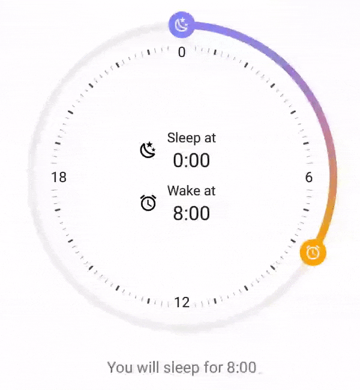
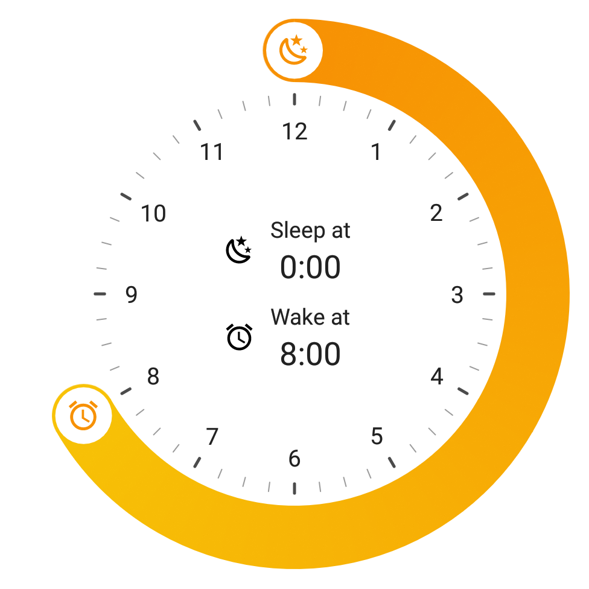
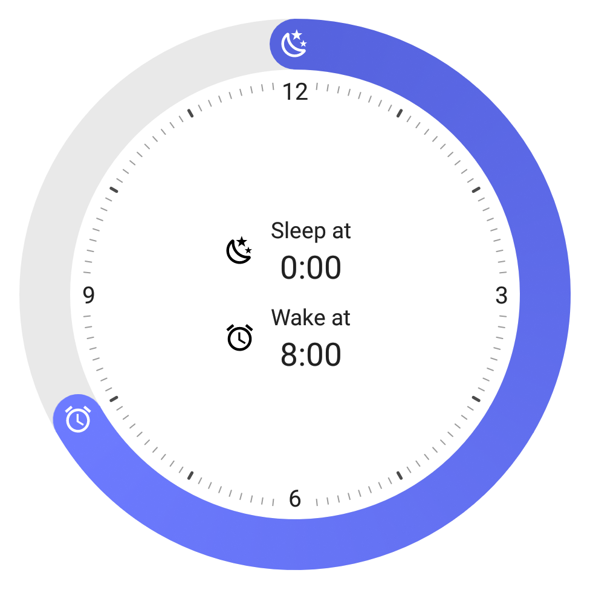
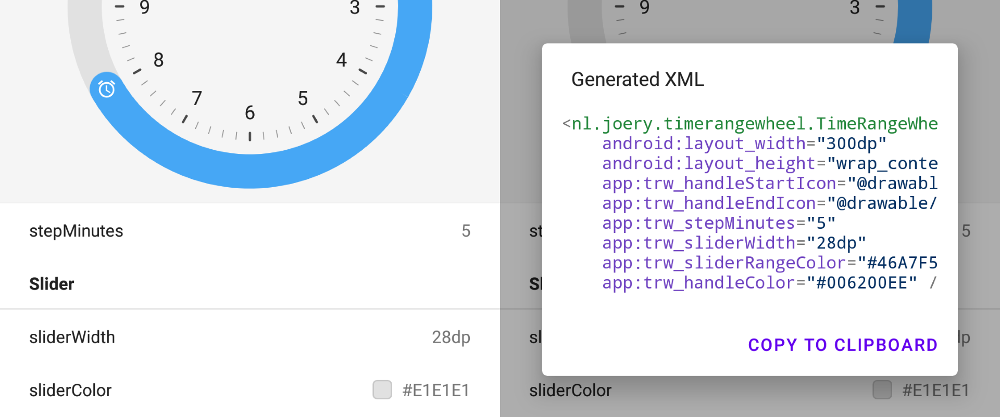
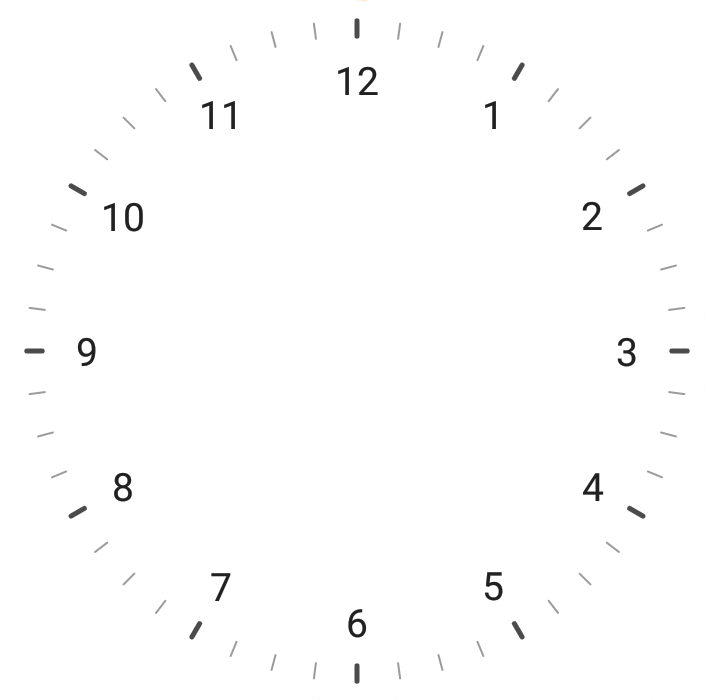
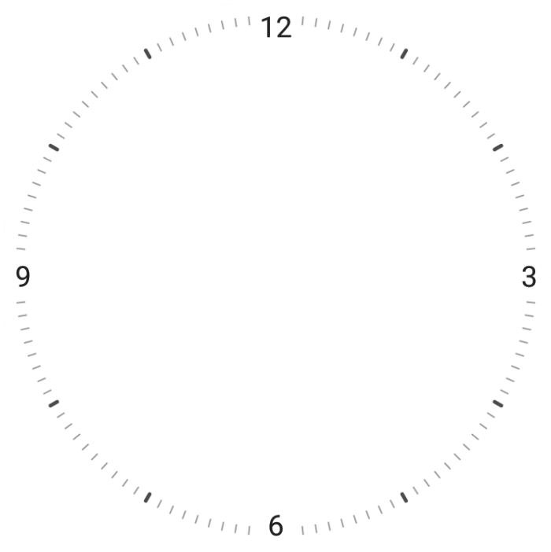

<h1 align="center">⏰ TimeRangePicker</h1></br>
<p align="center">
  
  <br><br>
  A customizable, easy-to-use, and functional circular time range picker library for Android. Use this library to mimic Apple's iOS or Samsung's bedtime picker.
</p>

<h6 align="center">
  &nbsp;&nbsp;
  &nbsp;&nbsp;
  &nbsp;&nbsp;
  &nbsp;&nbsp;By <a href="https://joery.nl">Joery Droppers</a>
</h6>

## Screenshots
 

## Playground app
<a href="https://play.google.com/store/apps/details?id=nl.joery.demo.timerangepicker">

&nbsp;&nbsp;&nbsp;&nbsp;
</a> 
<br><br>
Download the playground app from Google Play, with this app you can try out all features and even generate XML with your selected configuration.

## Getting started
This library is available on Maven Central, add the following dependency to your <b>build.gradle</b>:
```gradle
implementation 'nl.joery.timerangepicker:timerangepicker:1.0.0'
```
Define `TimeRangePicker` in your XML layout with custom attributes. See the [Configuration](#configuration) section for more information.
```xml
<nl.joery.timerangepicker.TimeRangePicker
    android:id="@+id/picker"
    android:layout_width="300dp"
    android:layout_height="wrap_content"
    app:trp_thumbIconEnd="@drawable/ic_alarm"
    app:trp_thumbIconStart="@drawable/ic_moon"
    app:trp_endTime="6:30"
    app:trp_startTime="22:00" />
```

Get notified when the time or duration changes:
```kotlin
picker.setOnTimeChangeListener(object : TimeRangePicker.OnTimeChangeListener {
    override fun onStartTimeChange(startTime: TimeRangePicker.Time) {
        Log.d("TimeRangePicker", "Start time: " + startTime)
    }

    override fun onEndTimeChange(endTime: TimeRangePicker.Time) {
        Log.d("TimeRangePicker", "End time: " + endTime.hour)
    }

    override fun onDurationChange(duration: TimeRangePicker.TimeDuration) {
        Log.d("TimeRangePicker", "Duration: " + duration.hour)
    }
})
```

## Managing picker programmatically
### Managing time
Examples of how to set and retrieve start time programmatically, identical properties are available for the end time.

```kotlin
// Set new time with 'Time' object to 12:00
picker.startTime = TimeRangePicker.Time(12, 0)
// Set new time by minutes
picker.startTimeMinutes = 320
```

<b>Time</b>
When retrieving the start or end time, the library will provide a `TimeRangePicker.Time` object.
- Use `time.hour`, `time.minute` or `time.totalMinutes` to retrieve literal time.
- Use `time.calendar` to retrieve a `java.util.Calendar` object.
- Use `time.localTime` to retrieve a `java.time.LocalTime` object. (Available since API 26)

### Managing duration
When retrieving the duration between the start and end time, the library will provide a `TimeRangePicker.Duration` object.
- Use `duration.hour`, `duration.minute` or `duration.durationMinutes` to retrieve literal duration.
- Use `duration.classicDuration` to retrieve a `javax.xml.datatype.Duration` object. (Available since API 8)
- Use `duration.duration` to retrieve a `java.time.Duration` object. (Available since API 26)

### Listening for starting and stopping of dragging
This listener is called whenever a user starts or stops dragging. It will also provide which thumb the user was dragging: <i>start, end, or both thumbs</i>. You can return false in the `ònDragStart` method to prevent the user from dragging a thumb.

```kotlin
picker.setOnDragChangeListener(object : TimeRangePicker.OnDragChangeListener {
    override fun onDragStart(thumb: TimeRangePicker.Thumb): Boolean {
        // Do something on start dragging
        return true // Return false to disallow the user from dragging a handle.
    }

    override fun onDragStop(thumb: TimeRangePicker.Thumb) {
        // Do something on stop dragging
    }
})
```

## Configuration
The attributes listed below can be used to configure the look and feel of the picker. Note that all of these values can also be set programmatically using the properties.
### Time
<table>
    <tr>
        <th>Attribute</th>
        <th>Description</th>
        <th>Default</th>
    </tr>
    <tr>
        <td><b>trp_startTime</b></td>
        <td>Set the start time by providing a time with format <i>h:mm</i>.</td>
        <td>0:00</td>
    </tr>
    <tr>
        <td><b>trp_startTimeMinutes</b></td>
        <td>Set the start time by providing minutes between 0 and 1440 (24 hours).</td>
        <td>0</td>
    </tr>
    <tr>
        <td><b>trp_endTime</b></td>
        <td>Set the end time by providing a time with format <i>h:mm</i>.</td>
        <td>8:00</td>
    </tr>
    <tr>
        <td><b>trp_endTimeMinutes</b></td>
        <td>Set the end time by providing minutes between 0 and 1440 (24 hours).</td>
        <td>480</td>
    </tr>
    <tr>
        <td><b>trp_minDuration</b></td>
        <td>Set the minimum selectable duration by providing a duration with format <i>h:mm</i>.</td>
        <td></td>
    </tr>
    <tr>
        <td><b>trp_maxDuration</b></td>
        <td>Set the maximum selectable duration by providing a duration with format <i>h:mm</i>.</td>
        <td></td>
    </tr>
    <tr>
        <td><b>trp_maxDurationMinutes</b></td>
        <td>Set the maximum selectable duration by providing minutes between 0 and 1440 (24 hours).</td>
        <td>480</td>
    </tr>
    <tr>
        <td><b>trp_minDurationMinutes</b></td>
        <td>Set the minimum selectable duration by providing minutes between 0 and 1440 (24 hours).</td>
        <td>0</td>
    </tr>
    <tr>
        <td><b>trp_stepTimeMinutes</b></td>
        <td>Determines at what interval the time should be rounded. Setting it to a less accurate number (e.g. 10 minutes) makes it easier for a user to select his desired time.</td>
        <td>10</td>
    </tr>
</table>

### Slider
<table>
    <tr>
        <th>Attribute</th>
        <th>Description</th>
        <th>Default</th>
    </tr>
    <tr>
        <td><b>trp_sliderWidth</b></td>
        <td>The width of the slider wheel.</td>
        <td>8dp</td>
    </tr>
        <tr>
        <td><b>trp_sliderColor</b></td>
        <td>The background color of the slider wheel.</td>
        <td>#E1E1E1</td>
    </tr>
    </tr>
        <tr>
        <td><b>trp_sliderRangeColor</b></td>
        <td>The color of the active part of the slider wheel.</td>
        <td>?android:colorPrimary</td>
    </tr>
    </tr>
        <tr>
        <td><b>trp_sliderRangeGradientStart</b></td>
    <td>Set the starting gradient color of the active part of the slider wheel.<br><br>Please note that both <i>trp_sliderRangeGradientStart</i> and <i>trp_sliderRangeGradientEnd</i> need to be configured.<br><br><b>Tip:</b> Set the <i>thumbColor</i> to transparent to mimic the Apple iOS slider.</td>
        <td></td>
    </tr>
    </tr>
        <tr>
        <td><b>trp_sliderRangeGradientStart</b></td>
    <td>Optional for gradient: set the middle gradient color of the active part of the slider wheel.</td>
        <td></td>
    </tr>
    </tr>
        <tr>
        <td><b>trp_sliderRangeGradientEnd</b></td>
    <td>Set the ending gradient color of the active part of the slider wheel.<br><br>Please note that both <i>trp_sliderRangeGradientStart</i> and <i>trp_sliderRangeGradientEnd</i> need to be configured.</td>
        <td></td>
    </tr>
</table>

### Thumb
<table>
    <tr>
        <th>Attribute</th>
        <th>Description</th>
        <th>Default</th>
    </tr>
    <tr>
        <td><b>trp_thumbIconStart</b></td>
        <td>Set the start thumb icon.</td>
        <td></td>
    </tr>
    <tr>
        <td><b>trp_thumbIconEnd</b></td>
        <td>Set the end thumb icon.</td>
        <td></td>
    </tr>
    <tr>
        <td><b>trp_thumbSize</b></td>
        <td>The size of both the starting and ending thumb.</td>
        <td>28dp</td>
    </tr>
    <tr>
        <td><b>trp_thumbSizeActiveGrow</b></td>
        <td>The amount of growth of the size when a thumb is being dragged.</td>
        <td>1.2</td>
    </tr>
    <tr>
        <td><b>trp_thumbColor</b></td>
        <td>The background color of the thumbs.</td>
        <td>?android:colorPrimary</td>
    </tr>
    <tr>
        <td><b>trp_thumbIconColor</b></td>
        <td>The color (tint) of the icons inside the thumbs.</td>
        <td>white</td>
    </tr>
    <tr>
        <td><b>trp_thumbIconSize</b></td>
        <td>The size of the thumb icons.</td>
        <td>24dp</td>
    </tr>
</table>

### Clock
<table>
    <tr>
        <th>Attribute</th>
        <th>Description</th>
        <th>Default</th>
    </tr>
    <tr>
        <td><b>trp_clockVisible</b></td>
        <td>Whether the clock face in the middle should be visible.</td>
        <td>true</td>
    </tr>
    <tr>
        <td><b>trp_clockFace</b></td>
        <td>There a two different clock faces (appearance of the inner clock) you can use, both mimicking the Clock apps:<br>
            <b>APPLE</b><br>
             <br>
            <b>SAMSUNG</b><br>
             
        </td>
        <td>APPLE</td>
    </tr>
    <tr>
        <td><b>trp_clockLabelSize</b></td>
        <td>The text size of the hour labels in the clock (1, 2, 3, etc.). This value is recommended to be set as scale-independent pixels (sp).</td>
        <td>16sp</td>
    </tr>
    <tr>
        <td><b>trp_clockLabelColor</b></td>
        <td>Set the text color of the hour labels in the clock.</td>
        <td>?android:textColorPrimary</td>
    </tr>
    <tr>
        <td><b>trp_clockIndicatorColor</b></td>
        <td>Set the color of the small time indicator lines in the clock.</td>
        <td>?android:textColorPrimary</td>
    </tr>
</table>

## Credits
- Samsung's and Apple's Clock app have been used for inspiration, as they both implement this picker differently.

## License
```
MIT License

Copyright (c) 2021 Joery Droppers (https://github.com/Droppers)

Permission is hereby granted, free of charge, to any person obtaining a copy
of this Software and associated documentation files (the "Software"), to deal
in the Software without restriction, including without limitation the rights
to use, copy, modify, merge, publish, distribute, sublicense, and/or sell
copies of the Software, and to permit persons to whom the Software is
furnished to do so, subject to the following conditions:

The above copyright notice and this permission notice shall be included in all
copies or substantial portions of the Software.

THE SOFTWARE IS PROVIDED "AS IS", WITHOUT WARRANTY OF ANY KIND, EXPRESS OR
IMPLIED, INCLUDING BUT NOT LIMITED TO THE WARRANTIES OF MERCHANTABILITY,
FITNESS FOR A PARTICULAR PURPOSE AND NONINFRINGEMENT. IN NO EVENT SHALL THE
AUTHORS OR COPYRIGHT HOLDERS BE LIABLE FOR ANY CLAIM, DAMAGES OR OTHER
LIABILITY, WHETHER IN AN ACTION OF CONTRACT, TORT OR OTHERWISE, ARISING FROM,
OUT OF OR IN CONNECTION WITH THE SOFTWARE OR THE USE OR OTHER DEALINGS IN THE
SOFTWARE.
```
